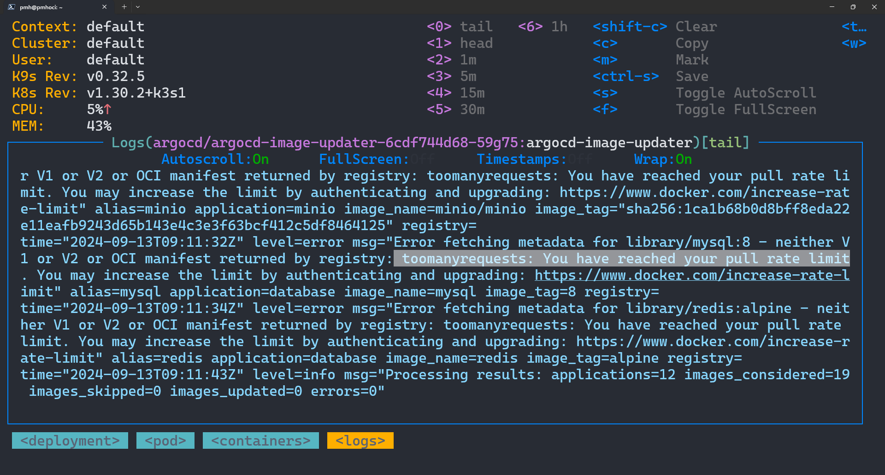
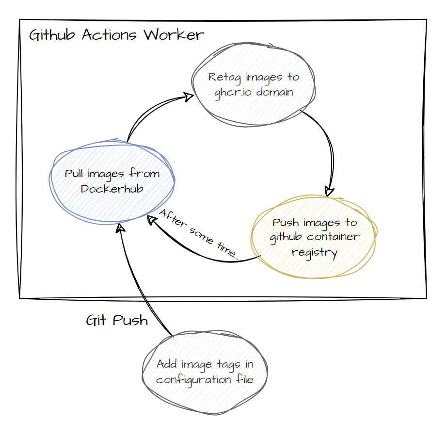

# 🐋🪞 dockerhub-mirror

## tl;dr
The Github Actions automatically replicate specific docker image tags from Dockerhub to GitHub Container Registry

## But why???
okay, i just wanna use [Argo CD Image Updater](https://argocd-image-updater.readthedocs.io/en/stable/) for my [lgtm (loki, grafana, etc..) stack](https://grafana.com/go/webinar/getting-started-with-grafana-lgtm-stack/)...

but **it keeps complaining about f*cking Dockerhub ratelimits** ahhhhhhh 🖕🖕🖕💢💢💢💢💢💢💢

so i looked for grafana images in other registry (like qury.io, public-ecr...)\
unfortunately, there isn't official image yet...
[someone posted issue about this in 2020](https://github.com/grafana/grafana/issues/27677), but i think the grafana team just forgot about it 😒

after a few minutes... i saw this issue called ["Did Dockerhub rate limit affect Github Action?"](https://github.com/actions/runner-images/issues/1445)

and yeah, **there's no dockerhub rate limit in github action worker** wow...\
then why did they put a f*cking rate limit on dockerhub??

anyway.. i think we can **transfer dockerhub images to the github container registry (which has no rate limits) through github actions (which also not affected by dockerhub ratelimit)**

## How it works?
talk is cheap.

profit.

## How to run
1. Fork this repository
2. Change configurations in `config.yml`
3. **IMPORTANT** Enable Github Actions
4. Profit.

## Copyrights???
um i donno, maybe public images are free to redistribution..\
uhhh just in case... this is just for *educational purpose* yea.. haha
